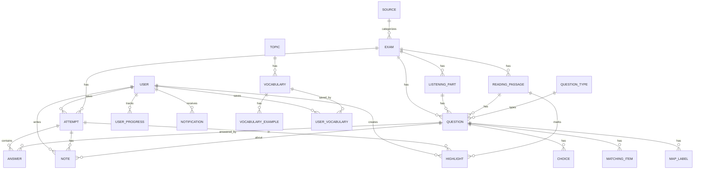

# Phân tích Model: Thực thể, quan hệ và hướng hoàn thiện

## 1) Mục tiêu tài liệu
Tài liệu này phân tích mô hình dữ liệu backend hiện tại của AimHigh để:
- Đánh giá từng thực thể theo vai trò nghiệp vụ.
- Mô tả quan hệ giữa các thực thể.
- Chỉ ra các điểm chưa chặt chẽ trong thiết kế model.
- Đề xuất các thay đổi cần làm để mô hình bền vững, dễ mở rộng và an toàn dữ liệu hơn.

Phạm vi đọc từ các entity trong package model, repository và service đang sử dụng thực tế.

---

## 2) Tổng quan nhóm thực thể

### Nhóm thi cử (core)
- User
- Exam
- ListeningPart
- ReadingPassage
- Question
- Choice
- MatchingItem
- MapLabel
- Attempt
- Answer
- QuestionType
- Source

### Nhóm học tập mở rộng
- Note
- Highlight
- UserProgress
- Notification

### Nhóm từ vựng
- Topic
- Vocabulary
- VocabularyExample
- UserVocabulary

### Nhóm kỹ năng sản xuất (đã có entity nhưng chưa vào luồng chính)
- SpeakingSubmission
- WritingSubmission
- StudyLog

---

## 3) Sơ đồ quan hệ hiện tại (ER ở mức nghiệp vụ)

Lưu ý: thực tế hiện tại có một số quan hệ tồn tại ở mức cột khóa ngoại nhưng chưa được ràng buộc đủ chặt (nullable, thiếu unique, thiếu check consistency).

---

## 4) Đánh giá theo từng cụm entity

## 4.1) Cụm thi cử chính

### User
Điểm tốt:
- Có email unique.
- Hỗ trợ LOCAL và OAuth qua authProvider/providerId.

Vấn đề:
- Chưa có ràng buộc rõ cho role/authProvider (nullable ngầm).
- Chưa có quan hệ ngược (attempts, notes, highlights, ...) để truy vết tổng quan user trong domain model.

Khuyến nghị:
- Đặt nullable = false cho role, authProvider.
- Cân nhắc thêm các collection quan hệ ngược nếu cần truy vấn theo aggregate.

### Exam
Điểm tốt:
- Có metadata cơ bản (skill, level, type, duration, trạng thái).
- Có quan hệ với listeningParts và readingPassages.

Vấn đề:
- Vừa lưu examData dạng JSON, vừa lưu cấu trúc quan hệ chuẩn hóa (parts/passages/questions) => mô hình lai, dễ lệch dữ liệu.
- source_id và created_by có thể null, chưa rõ quy tắc bắt buộc.

Khuyến nghị:
- Chốt chiến lược: JSON-only hoặc relational-first. Nếu tiếp tục mô hình lai, cần cơ chế đồng bộ 2 chiều và checksum/version.
- Nếu nghiệp vụ yêu cầu, đặt not-null cho created_by, is_active, skill, level, type.

### Question
Điểm tốt:
- Bao phủ nhiều loại câu hỏi qua Choice/MatchingItem/MapLabel.

Vấn đề quan trọng:
- Có đồng thời exam_id, listening_part_id, reading_passage_id. Nếu không có constraint sẽ dễ lệch logic (question thuộc exam A nhưng passage thuộc exam B).
- Chưa thấy unique constraint cho (exam_id, question_number), trong khi service chấm điểm phụ thuộc mạnh vào cặp này.
- question_type_id tồn tại nhưng import hiện tại chưa set nhất quán.

Khuyến nghị:
- Bắt buộc unique (exam_id, question_number).
- Thêm check logic: một Question chỉ thuộc đúng một ngữ cảnh nội dung (listening_part hoặc reading_passage), và phải đồng nhất exam.
- Hoàn thiện mapping QuestionType trong import và validate đầu vào.

### ListeningPart / ReadingPassage
Điểm tốt:
- Có thứ tự và metadata cơ bản.

Vấn đề:
- ReadingPassage đang dùng một trường passageOrder cho cả ý nghĩa section và order nội bộ passage.
- Luồng import reading đang đặt passageOrder = section * 10 + index, trong khi luồng đọc section lại lọc theo passageOrder == sectionNumber. Đây là dấu hiệu mô hình chưa chuẩn tách lớp.

Khuyến nghị:
- Tách 2 trường rõ nghĩa:
  - sectionNumber (thuộc section nào)
  - passageOrderInSection (thứ tự trong section)
- Cập nhật service đọc/ghi theo mô hình mới để tránh sai lệch dữ liệu.

### Attempt / Answer
Điểm tốt:
- Quy trình start/submit rõ và có trạng thái.
- Có quan hệ Attempt -> Answers đầy đủ.

Vấn đề:
- Chưa có unique/index cho trạng thái attempt theo user+exam (đang dựa kiểm tra ở service).
- timeSpent/score/bandScore chưa có quy tắc nullable rõ.
- Answer thiếu unique theo (attempt_id, question_id), có thể phát sinh nhiều answer cho cùng câu trong cùng lượt làm.

Khuyến nghị:
- Thêm unique hoặc kiểm soát ghi đè theo (attempt_id, question_id).
- Tạo index cho các truy vấn nóng:
  - attempts(user_id, started_at)
  - attempts(user_id, exam_id, status)
  - answers(attempt_id)

### Choice / MatchingItem / MapLabel
Điểm tốt:
- Đủ cấu trúc cho nhiều dạng bài.

Vấn đề:
- MapLabel có image_url ở từng label, dễ lặp dữ liệu nếu một question có nhiều label trên cùng một ảnh.
- Nhiều cột chưa có not-null dù về nghiệp vụ thường bắt buộc.

Khuyến nghị:
- Cân nhắc chuyển image_url lên cấp Question hoặc tạo bảng map_asset riêng.
- Chuẩn hóa not-null cho các cột lõi theo từng loại câu hỏi.

---

## 4.2) Cụm note/highlight/progress/notification

### Note
Điểm tốt:
- Có đủ khóa đến user, attempt, question.

Vấn đề:
- updatedAt chưa tự cập nhật bằng @PreUpdate.
- Chưa có unique/rule chống trùng note theo cùng ngữ cảnh (nếu mong muốn mỗi question chỉ có 1 note/user/attempt).

Khuyến nghị:
- Thêm @PreUpdate cho updatedAt.
- Nếu nghiệp vụ cần: unique(user_id, attempt_id, question_id).

### Highlight
Điểm tốt:
- Có kiểm tra ownership và thuộc đúng passage của exam ở service.

Vấn đề:
- Chưa có check tránh overlap trùng lặp không mong muốn (tùy yêu cầu UX).
- color đang là chuỗi tự do, chưa enum hoặc whitelist.

Khuyến nghị:
- Nếu cần dữ liệu sạch: enum hóa màu highlight.
- Cân nhắc index (attempt_id, reading_passage_id, user_id, created_at).

### UserProgress
Vấn đề:
- Có repository findByUserIdAndSkill nhưng chưa thấy unique constraint DB cho cặp này.
- updatedAt không có lifecycle update chuẩn.

Khuyến nghị:
- Unique(user_id, skill).
- Bổ sung @PrePersist + @PreUpdate cho updatedAt.

### Notification
Vấn đề:
- isRead có thể null gây phức tạp logic lọc.

Khuyến nghị:
- Đặt default false + not-null cho isRead.
- Thêm index (user_id, is_read, created_at).

---

## 4.3) Cụm từ vựng

### Vocabulary / VocabularyExample / Topic / UserVocabulary
Điểm tốt:
- Đủ mô hình cho từ vựng + ví dụ + từ đã lưu theo user.

Vấn đề:
- Vocabulary lookup có thể tạo mới bản ghi chỉ với mỗi word, dẫn đến dữ liệu thiếu chất lượng.
- Thiếu unique cho word (hoặc word + partOfSpeech tùy nghiệp vụ).
- UserVocabulary chưa có unique(user_id, vocab_id), hiện chống trùng chủ yếu ở service.

Khuyến nghị:
- Chốt khóa nghiệp vụ cho Vocabulary (ít nhất unique normalized_word).
- Thêm unique(user_id, vocab_id).
- Bổ sung trường normalizedWord để tra cứu ổn định hơn (lowercase/trim).

---

## 4.4) Cụm chưa đi vào luồng chính

Các entity SpeakingSubmission, WritingSubmission, StudyLog đã định nghĩa nhưng chưa thấy repository/service/controller đang dùng.

Khuyến nghị:
- Nếu sắp dùng: bổ sung đầy đủ repository + service + API + migration + index.
- Nếu chưa dùng trong ngắn hạn: đánh dấu roadmap rõ ràng hoặc tạm tách module để tránh nợ mô hình “treo”.

---

## 5) Những điểm cần sửa để hoàn thiện (ưu tiên thực thi)

## P0 - Bắt buộc để tránh lỗi dữ liệu
1. Thêm unique constraint:
- questions(exam_id, question_number)
- user_vocabulary(user_id, vocab_id)
- user_progress(user_id, skill)
- answers(attempt_id, question_id)

2. Bổ sung not-null cho cột lõi nghiệp vụ:
- attempt.user_id, attempt.exam_id, attempt.status
- answer.attempt_id, answer.question_id
- question.exam_id
- exam.skill, exam.level, exam.type, exam.is_active

3. Chuẩn hóa mô hình ReadingPassage:
- Tách sectionNumber và passageOrderInSection.
- Đồng bộ toàn bộ service import/detail theo mô hình mới.

## P1 - Ổn định và dễ bảo trì
1. Thêm index cho truy vấn nóng:
- attempts(user_id, exam_id, status)
- attempts(user_id, started_at)
- answers(attempt_id)
- highlights(attempt_id, reading_passage_id, user_id, created_at)
- notes(attempt_id, user_id, created_at)

2. Lifecycle timestamp:
- Note.updatedAt: @PreUpdate
- UserProgress.updatedAt: @PrePersist + @PreUpdate

3. Chuẩn hóa enum/value object:
- Highlight color chuyển sang enum hoặc whitelist.

## P2 - Nâng chất lượng domain
1. Giảm “mô hình lai” Exam (JSON + relational) hoặc bổ sung cơ chế đồng bộ chính thức.
2. Hoàn thiện QuestionType flow từ import tới chấm điểm/thống kê.
3. Tăng tính biểu đạt domain bằng aggregate rõ ràng theo bounded context (Exam, Attempt, Vocabulary).

---

## 6) Lộ trình triển khai đề xuất

Giai đoạn 1 (an toàn dữ liệu):
- Viết migration cho unique/not-null/index.
- Sửa dữ liệu cũ trước khi bật constraint (script cleanup).

Giai đoạn 2 (chuẩn hóa quan hệ):
- Refactor ReadingPassage tách section/order.
- Cập nhật import JSON/Excel và APIs đọc đề.

Giai đoạn 3 (củng cố domain):
- Quy hoạch lại chiến lược examData.
- Kích hoạt hoặc tách riêng module Speaking/Writing/StudyLog.

---

## 7) Checklist xác nhận sau khi sửa

- Không còn bản ghi trùng (exam_id, question_number).
- Không còn bản ghi user_vocabulary trùng user-vocab.
- Mỗi answer trong một attempt là duy nhất theo question.
- Luồng import Reading hiển thị đúng section/question range.
- Báo cáo tiến độ và truy vấn lịch sử attempt vẫn đúng sau migration.
- Toàn bộ API cũ vẫn tương thích hoặc có kế hoạch versioning rõ ràng.

---

## 8) Kết luận
Model hiện tại đã đủ để chạy luồng chính Reading/Listening và phần từ vựng cơ bản. Tuy nhiên, để đạt mức production ổn định lâu dài, cần ưu tiên siết chặt ràng buộc dữ liệu (P0), sau đó chuẩn hóa mô hình section/passage (P1), rồi mới tối ưu domain sâu hơn (P2).

Nếu thực hiện đúng thứ tự, hệ thống sẽ giảm đáng kể lỗi dữ liệu ngầm, dễ mở rộng tính năng và dễ bảo trì hơn trong các học kỳ sau.
